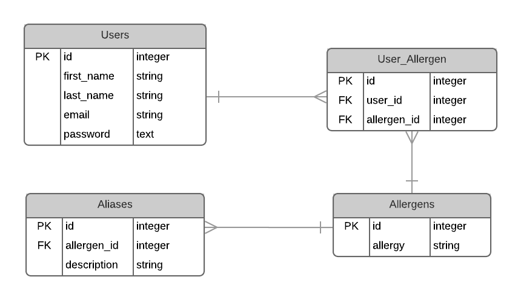

# AllergEase (Server)

## ABOUT THIS APPLICATION
AllergEase is a full-stack mobile responsive React Redux application that helps you spot allergens with ease. 

Food allergy awareness has greatly increased recently. However, grocery shopping is still complicated due to unexpected food pseudonyms and additives. Allergease provides ease of mind for people with restricted diets and the people who shop for them. 

Instead of laboring over long ingredient lists, trust Allergease to keep your loved ones healthy.

It makes shopping easier by supplementing a shopper’s perusal of product ingredients with a database that provides immediate certainty.

## GETTING STARTED
These instructions will get you a copy of the project up and running on your local machine for development and testing purposes. See deployment for notes on how to deploy the project on a live system.

## THE FRONTEND
The frontend can be found at: 
* https://github.com/wsparsons/AllergEase-Client

## DATABASE STRUCTURE 

## SETUP
* Fork and clone this repository
* `npm install`
* `createdb allergease_dev`
* `npm run knex migrate:latest`
* `npm run knex seed:run`

## DEPLOYMENT
This project has been deployed on Heroku at: 
* https://allergease.herokuapp.com

## BUILD WITH
* [postgreSQL](https://www.postgresql.org/) - an object-relational database management system
* [Axios](https://github.com/axios/axios) - Promise based HTTP client for the browser and node.js
* [Express.js](https://expressjs.com/) - A Node.js web application framework that provides a robust set of features for web and mobile applications
* [Knex.js](https://knexjs.com/) - SQL query builder for Postgress

## CONTRIBUTING
-Please send the developer a message for details on the code of conduct, and the process for submitting pull requests.

## AUTHOR
**Wendy Parsons** - [wsparsons](https://github.com/wsparsons)

## LICENSE
This project is licensed under the MIT License - see the [LICENSE.md](LICENSE.md) file for details